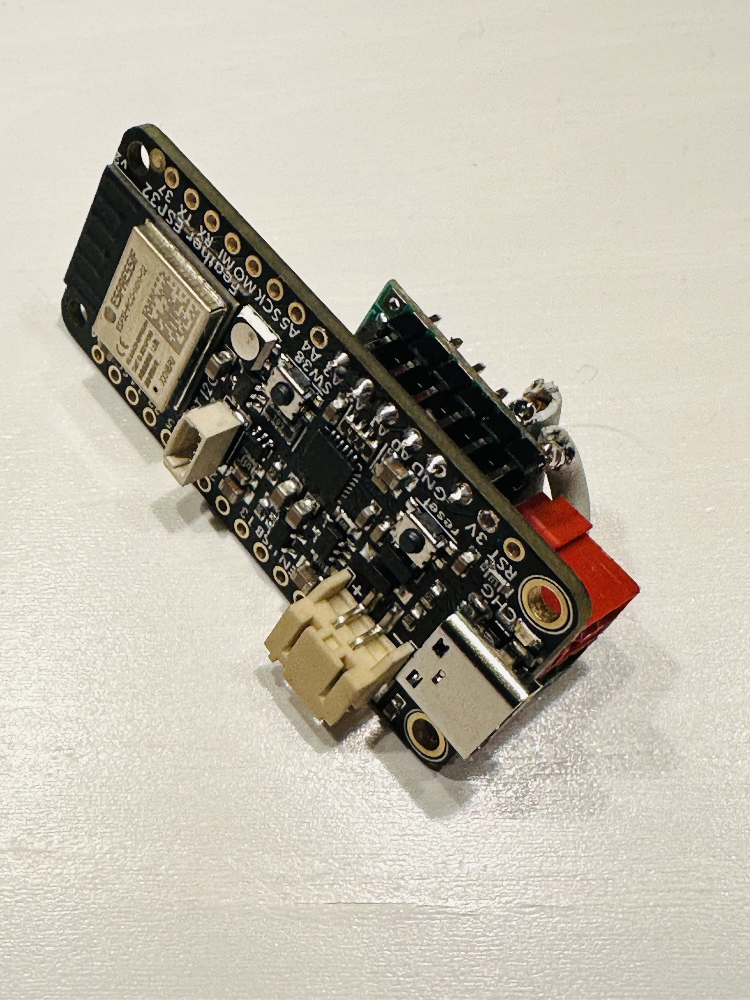
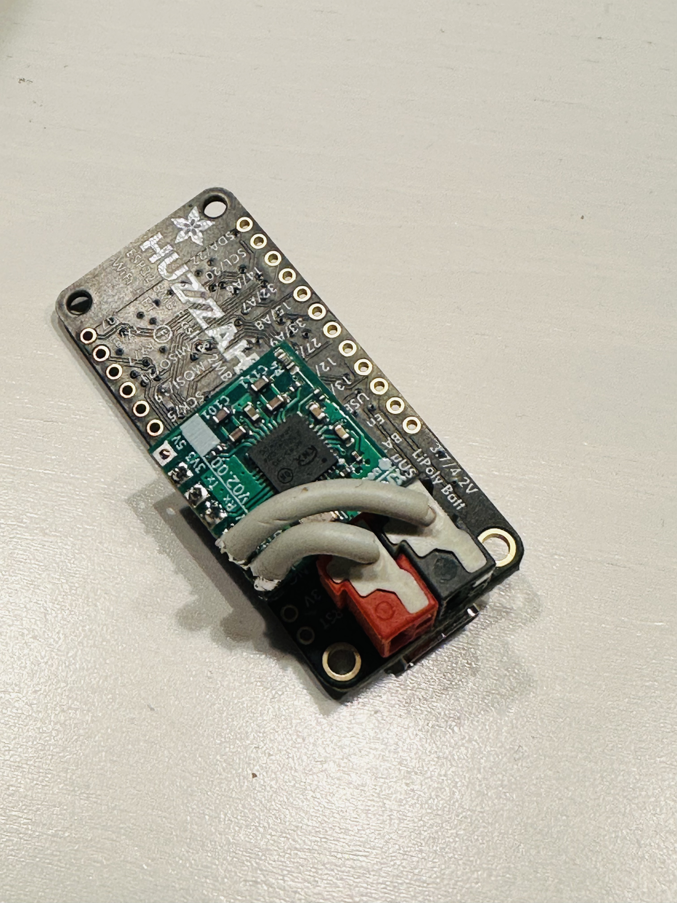
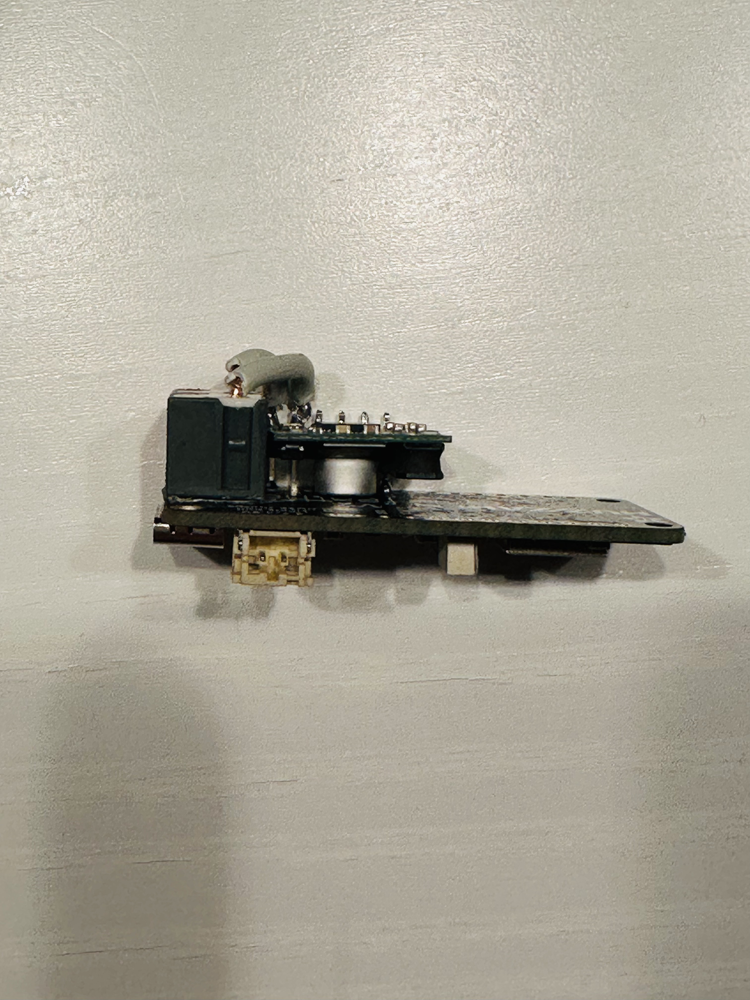
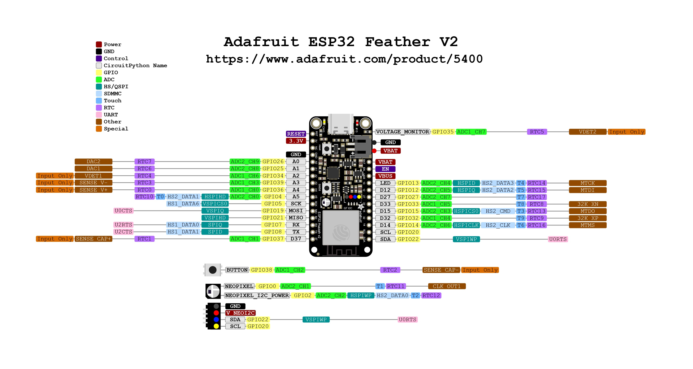

# OpenKNX Smart Home Bridge

Die OpenKNX Smart Home Bridge erlaubt KNX Geräte über Apple Home und Amazon Alexa zu steuern.

## Features
- Homekit Unterstützung 
- Hue Emulation für Amazon Alex für: Schaltbare und dimmbare Lampen
- Hue Emulation für Rollanden und Jalousien, dargestellt als dimmbare Lampen
- SW-Updates können über WLAN (OTA) eigespielt werden

### Unterstützte Geräte

- Schalten
- Steckdose
- Lampe (Schaltbar, Dimmbar, RGB)
- Jalousie (In Alexa als dimmbare Lampe dargestellbar)
- Rolladen (In Alexa als dimmbare Lampe dargestellbar)
- Markise (In Alexa als dimmbare Lampe dargestellbar)
- Thermostat (Nur Homekit)
- Anzeige (Temperatur, Luftfeuchtigkeit, Helligkeit) (Nur Homekit)
- Kontakt (Nur Homekit)
- Bewegungsmelder (Nur Homekit)
- Präsensmelder (Nur Homekit)
- Leckmelder (Nur Homekit)
- Rauchmelder (Nur Homekit)
- Kohlendioxidmelder (Nur Homekit)
- Kohlenmonoxidmelder (Nur Homekit)
- Lüfter (In Alexa als schaltbare Lampe dargestellbar)
- Fenster (Mit oder ohne Motorantrieb) (Nur Homekit)
- Tür (Mit oder ohne Motorantrieb) (Nur Homekit)
- Garagentor (Mit oder ohne Motorantrieb) (Nur Homekit)

## HW

Empfohlene Hardware:

- [Adafruit ESP32 Feather V2 - 8MB Flash + 2 MB PSRAM](https://www.adafruit.com/product/5400)
- [NanoBCU](https://github.com/OpenKNX/OpenKNX/wiki/NanoBCU) Bezugsquelle: [https://muster.ing-dom.de](https://muster.ing-dom.de/Busankoppler/NanoBCU-Standard.html)
- USB Netzteil (Notwendig, das der Strom der NanoBCU nicht ausreichend ist)

Am Besten verlötet man die NanoBCU wie im Foto mit einer 6 poligen Pfostenleiste.

|  |  |  |
|-|-|-|

Dabei müssen folgende Pins verlötet werden:

| NanoBCU | ESP32           |
|---------|-----------------|
| KNX     | NC              |
| GND     | GND             | 
| SAV     | GPIO26 (A0)     |
| RX      | GPIO25 (A1)     |
| TX      | GPIO34 (A2)     |
| 5V      | nicht verbinden |

Die KNX Klemme kann mit Doppelseitigem Klebeband ebenfalls auf dem Board plaziert werden und mit einem Stück Installationsdraht mit den GND und KNX Pin der NanoBCU verlötet werden.

Andere ESP32 Hardware kann benutzt werden, die Firmeware muss dafür aber selber angepasst werden. Achtung: bei Boards ohne PSRAM dürfen maximal 50 Kanäle definiert werden.

## Firmware

Eine vorkomplierte Firmware ist hier ... zu finden. ZIP Datei herunterladen, entpacken und der Anleitung im Readme folgen.

## Anwenderdokumentation

Die Anwenderdokumentation ist [hier](./src/Baggages/Help_de/BRI-Doc.md) zu finden.